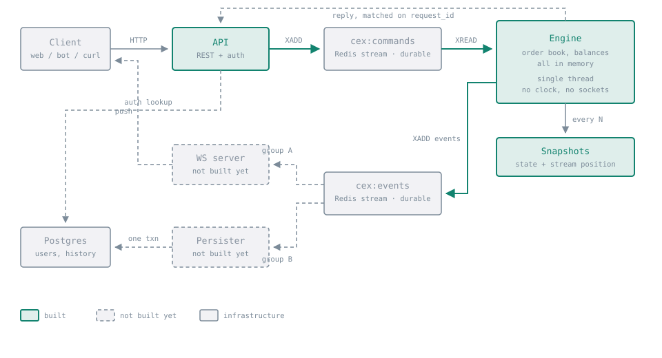
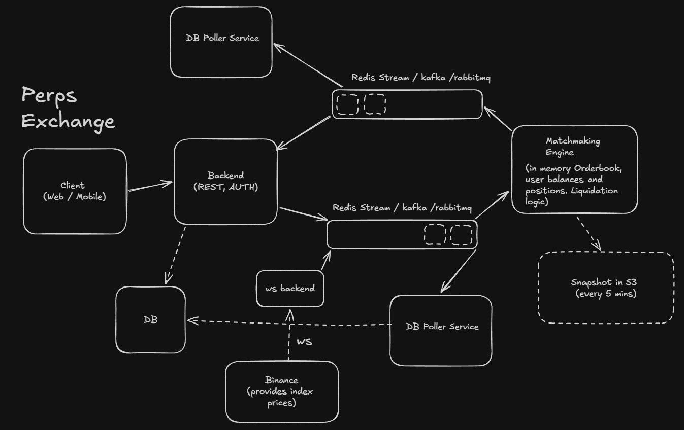
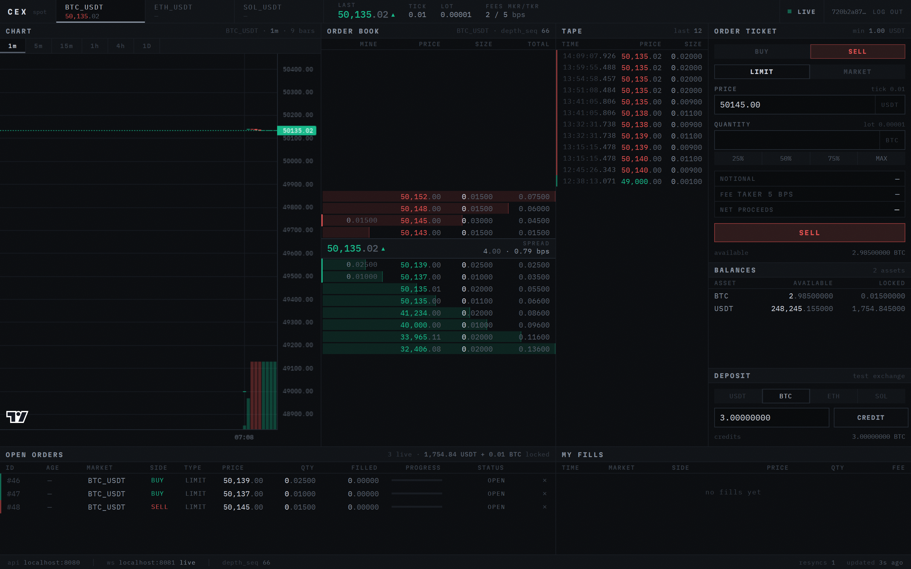

# cex

A centralised exchange in Rust. Spot markets first, perpetual futures on the same engine.

The exchange is a **deterministic state machine**: one function, `apply(state, command) -> events`,
running single-threaded over a durable command log. Everything else — HTTP, WebSocket, Postgres,
snapshots — is plumbing around that.

## Architecture



Every arrow is a real network hop between separate processes. The write path runs left to right
along the top and loops back along the bottom; because everything that mutates state goes through
`cex:commands`, that one stream is a complete, replayable record of everything that ever happened.

Perpetual futures reuse all of it — same order book, same matching loop, same recovery — adding a
price feed and three command types:



## Status

| Component | State |
|---|---|
| `cex-core` — matching, ledger, settlement, snapshots, idempotency | Built · 132 tests |
| `cex-proto` — wire types | Built · 18 tests |
| `engine` — stream consumer, snapshots, crash recovery, boot lock | Built · 53 tests |
| `api` — loopback, auth, REST routes | Built · 74 tests |
| `persist` — Postgres history writer | Built · 27 tests |
| `ws` — market data fan-out | Built · 52 tests |
| Perpetuals | Not started |

**The spot exchange is complete.** Two users can register, deposit, place orders, match and settle
over HTTP; every order, fill and balance change lands in Postgres behind the engine; and the book,
the trades and each user's own orders stream live over WebSocket. What is left is perpetuals, and
the gaps listed below.

## Running it

```bash
docker compose up -d                     # redis on 6390, postgres on 5442
cargo build --release

./target/release/engine &                # consumes cex:commands
CEX_JWT_SECRET=$(openssl rand -hex 32) \
  ./target/release/api &                 # listens on :8080
./target/release/persist &               # cex:events → postgres
CEX_JWT_SECRET=$SECRET \
  ./target/release/ws &                  # cex:events → websocket, on :8081
```

`ws` must be given the **same** `CEX_JWT_SECRET` as `api`, or it cannot verify the tokens `api`
issues and every private subscription is refused. It exits at boot rather than serve a feed whose
private channels silently never work.

`persist` is optional to trade — the engine does not wait on it, and stopping it costs history
freshness and nothing else. Give each deployed instance its own stable `CEX_PERSIST_CONSUMER`
name: Redis holds unacknowledged entries against the name that received them, so a name that
changed on every boot would orphan its own backlog.

```bash
# register, fund, and trade
TOKEN=$(curl -s -XPOST localhost:8080/register \
  -H 'content-type: application/json' \
  -d '{"username":"alice","password":"a-good-password"}' | jq -r .token)

curl -s -XPOST localhost:8080/deposit -H "authorization: Bearer $TOKEN" \
  -H 'content-type: application/json' -d '{"asset":"USDT","amount":1000000000}'

curl -s -XPOST localhost:8080/orders -H "authorization: Bearer $TOKEN" \
  -H 'content-type: application/json' \
  -d '{"symbol":"BTC_USDT","side":"BUY","order_type":"LIMIT",
       "time_in_force":"GTC","price":50000000000,"qty":100000}'

curl -s localhost:8080/depth/BTC_USDT

# watch the book and the tape
cargo run -p cex-ws --example tail -- trades@BTC_USDT depth@BTC_USDT
# watch your own orders
cargo run -p cex-ws --example tail -- --token "$TOKEN" orders
```

Amounts are integers in atomic units — see [Scaling](#scaling).

## The screen



One trading screen, in `frontend/` — TypeScript, React and Vite, talking to the same four
processes as everything else. No mock backend anywhere, including in its tests.

Everything above is live: the ladder is this engine's book, `MINE` is the caller's own resting
size at each level, and the locked balances are what those orders are holding. The chart is thin
because a freshly started test exchange has genuinely only traded a handful of times.

```bash
cd frontend
npm install
npm run dev          # http://localhost:5173

npm run typecheck    # tsc --noEmit
npm run lint
npm test             # unit: the number layer and the depth book
npm run e2e          # playwright, against the running stack
```

The engine must be started with **`CEX_BLOCK_MS=200`** or every snapshot fetch takes five seconds
— see [Known gaps](#known-gaps).

Three things it does that are easy to get wrong:

**Money never becomes a float.** `JSON.parse` rounds a 64-bit integer to a double *before* any
reviver can see it, so the parser reads the source text and hands back `bigint`, and the serialiser
uses `JSON.rawJSON` on the way out. Formatting slices digits rather than dividing. The one place a
number is produced is the chart, at the very edge, for pixels.

**The depth feed resyncs on a gap.** `depth_seq` is monotonic per symbol; anything other than
exactly one past the last is refused, the book is marked stale, and nothing is applied again until
a fresh `GET /depth/:symbol` arrives. Applying the next delta onto a book that is already wrong
gives a book that stays wrong for the life of the connection and never looks wrong.

**Connection state is visible.** A gap, a dropped socket, or simply no updates for a while dims
the book and the tape, names the reason in a band across the ladder, and disables the ticket.

## Endpoints

| Method | Path | Auth | |
|---|---|---|---|
| `GET` | `/health` | — | liveness |
| `POST` | `/register` | — | create an account, returns a token |
| `POST` | `/login` | — | exchange credentials for a token |
| `GET` | `/markets` | — | tradable pairs and their tick, lot and fee rules |
| `GET` | `/depth/:symbol` | — | current order book |
| `POST` | `/deposit` | yes | credit an account |
| `GET` | `/balances` | yes | available and locked, per asset |
| `POST` | `/orders` | yes | place a limit or market order |
| `DELETE` | `/orders/:id` | yes | cancel a resting order |
| `GET` | `/orders/open` | yes | your live orders |
| `GET` | `/orders/history` | yes | your own fills, newest first (`?limit=`, max 500) |
| `GET` | `/trades/:symbol` | — | recent trade prints, newest first (`?limit=`, max 500) |
| `GET` | `/candles/:symbol` | — | OHLCV bars, **oldest first** (`?interval=1m\|5m\|15m\|1h\|4h\|1d`, `?limit=`, max 500) |

`/trades/:symbol` is the public tape and names nobody. `/orders/history` is the same rows scoped
to the caller and told from their side — their order id, their side, their role, the fee they
paid — and still says nothing about who was on the other side of the trade.

`/candles/:symbol` aggregates the same fills into OHLCV bars, and is **a display projection and
nothing more**. It buckets on `created_at` — when the persister wrote the row, not when the trade
matched, because the engine owns no clock by design. That is good enough to draw a chart with and
wrong for anything that prices, values or settles, so nothing but a chart may read it. Open and
close come from `(seq, idx)`, the order the engine really matched the fills in, rather than from
the timestamp. Prices stay quote atoms and volume base atoms all the way to the wire; the chart
divides for display, and design rule 2 does not bend for a chart.

Bars come back oldest first — a chart draws left to right — while `limit` still keeps the *newest*
buckets. Intervals are a fixed set rather than a parsed duration, because the value becomes a
divisor inside the aggregate.

A browser may call the API from the origins named in `CEX_CORS_ORIGINS` (comma-separated;
unset means the Vite dev server). Listed explicitly, never `*`: a wildcard would hand a
token-bearing API to any page on the internet. `authorization` and `idempotency-key` are in the
allowed set, because a browser silently strips any header that is not.

## Scaling

Prices and quantities are integers, never floats.

* A **quantity** counts `10^-base_decimals` units of the base asset. BTC has 8 decimals, so
  `qty: 100000` is 0.001 BTC.
* A **price** counts quote atomic units per *one whole* base unit. USDT has 6 decimals, so
  `price: 50000000000` is 50,000.00 USDT per BTC.
* Therefore `notional = price × qty / 10^base_decimals`, in quote atoms.

## Getting started

```bash
docker compose up -d      # redis on 6390, postgres on 5442
cargo test                # 356 tests; the engine, api, persist and ws suites need both containers
cargo clippy --all-targets -- -D warnings
```

The toolchain is pinned in `rust-toolchain.toml`; rustup will fetch the right compiler
automatically.

## Layout

```
crates/
├── proto/     # every message that crosses a process boundary
├── core/      # the engine. no tokio, no redis, no clock, no f64
├── engine/    # [bin] command stream in → core → event stream out
├── api/       # [bin] REST + auth + loopback to the engine
├── ws/        # [bin] market data fan-out
└── persist/   # [bin] event stream → Postgres
```

`core` has no async dependencies **on purpose**. A crate that cannot perform I/O cannot
accidentally become non-deterministic, and the constraint is enforced by the manifest rather
than by review.

## History

`persist` reads `cex:events` and writes four tables. It is a separate process because **the engine
must never wait on a database**: the engine publishes a batch and moves on in microseconds while
the persister catches up at whatever speed Postgres allows.

| Table | |
|---|---|
| `event_batches` | one row per applied command, keyed on `seq`. The dedupe guard. |
| `orders` | one row per order, updated in place as it fills or is cancelled |
| `fills` | one row per match, immutable, keyed `(seq, idx)` |
| `balance_changes` | append-only trail of every balance-affecting event |

Unlike the engine, it reads with `XREADGROUP`: it has no snapshot of its own, so it wants exactly
what a consumer group gives — Redis tracks the cursor, and anything unacknowledged comes back.

Delivery is therefore at-least-once, twice over: Redis redelivers what was never acknowledged, and
the engine republishes events whenever recovery replays the command log. Both are handled the same
way. A batch and the row recording that it was written commit in **one transaction**, so a crash
anywhere leaves history exactly as it was and the redelivery that follows re-does the work cleanly.

## Market data

`ws` reads `cex:events` through its own consumer group — separate from the persister's, so the two
read the same stream without competing — and fans every update out over a
`tokio::sync::broadcast` channel. The stream is read **once** no matter how many clients are
connected; one Redis reader per connection would multiply load on the stream by the number of
subscribers, which is exactly backwards for the one component whose job is to have a lot of them.

| Channel | |
|---|---|
| `depth@SYMBOL` | public. Incremental book updates, carrying the monotonic `depth_seq` |
| `trades@SYMBOL` | public. Trade prints |
| `orders` | **private.** Your own orders and your own fills. Requires a token |

```json
{"op": "auth", "token": "..."}
{"op": "subscribe", "channels": ["depth@BTC_USDT", "orders"]}
```

Unlike the persister, this group starts at the **tail** of the stream. History and live data want
opposite things: a batch `persist` never wrote is a hole in the record forever, whereas replaying
yesterday's depth deltas into a fresh connection would not be catching up, it would be lying about
the state of the book.

Two rules this crate exists to keep:

**A public channel never carries a user id.** `cex_proto::Fill` names both counterparties, so
forwarding one to `trades@SYMBOL` would tell everyone who traded with whom. The public message is a
separate type with no user fields, so the leak does not compile rather than relying on review.

**A slow subscriber is dropped, never allowed to stall the others.** Each connection has its own
cursor into a shared ring buffer, so one that stops reading falls behind alone. When it falls off
the end its connection is closed and it is told why — a client that carried on would be rebuilding
a book from a feed with a silent hole in it, which is wrong without ever looking wrong.

## Design rules

These are not preferences. Breaking any one of them breaks something that depends on it.

**1. The engine is pure.** No clock, no randomness, no sockets, no file reads inside `apply`.
Anything from the outside world — timestamps, mark prices, funding ticks — enters as a command
appended to the log first. This is what makes snapshot-and-replay recovery exact. Break it and
replay silently produces different state than the original run.

**2. Money is integers.** `i64` counts of atomic units, `i128` for intermediate products, one
`mul_div` helper with explicit rounding direction. `f64` must never appear in `core`.

**3. Reads are not logged.** State-changing requests are `Command` and go on the durable stream.
Read-only requests are `Query` and travel on a separate channel. Logging reads would bloat the
log and slow every replay for no benefit.

**4. Locked balances are real.** Funds backing a resting order move from `available` to `locked`
and are released exactly, never recomputed. `check_invariants()` asserts after every command that
supply is conserved and that every locked atom is backed by a live order.

**5. Fills print at the maker's price.** Price improvement belongs to the taker, and any
difference between the reservation and the actual cost is refunded immediately.

**6. Exactly one engine per command stream.** The engine reads with plain `XREAD`, not a consumer
group, so a second instance would read the same commands and apply everything twice. A Redis lease
on `<commands-stream>:lock` enforces it: the engine takes it at boot, renews it while it runs, and
stops the moment it cannot. A second engine refuses to start and names the one holding the stream.

## Retrying safely

A `504` from the API is genuinely ambiguous: the command is already on the durable log, so a
timeout is not proof that nothing happened. Send an `Idempotency-Key` and a retry becomes safe.

```bash
curl -XPOST localhost:8080/orders -H "authorization: Bearer $TOKEN" \
  -H 'idempotency-key: my-order-1' -H 'content-type: application/json' \
  -d '{"symbol":"BTC_USDT","side":"BUY","order_type":"LIMIT",
       "time_in_force":"GTC","price":50000000000,"qty":100000}'
```

Send it again with the same key and you get the same `order_id` back, not a second order. Accepted
on `POST /deposit`, `POST /orders` and `DELETE /orders/:id`.

The API turns the key into the command's `request_id` — a UUIDv5 derived from the key **and the
caller**, so two users may pick `"1"` without either receiving the other's answer. The engine
remembers ids it has applied along with what each one returned, so a repeat is answered from that
record: no state changes, no events are published, and `seq` does not advance.

Three things worth knowing:

* **It is opt-in.** Without the header every request gets a fresh id, because two deliberate
  identical orders are a normal thing to want.
* **Rejected commands are not remembered.** A command that failed changed nothing, so re-running it
  is harmless — and remembering the failure would leave you unable to retry a request that never
  happened.
* **The window is 50,000 commands.** Beyond that the id is forgotten and a retry applies as new.

Because every applied command is recorded, the command log itself is exactly-once: appending the
same command twice, however that happens, applies it once.

## Running exactly one engine

The engine takes a lease on `<commands-stream>:lock` before it reads anything, renews it once a
third of the lease has gone, and **stops** if a renewal finds the lock is no longer its own. A
second engine on the same stream refuses to start:

```
Error: the command stream cex:commands is already owned by engine engine-ab5bb596-...
```

Two engines on two different command streams is a legitimate deployment, so the key is derived from
the stream name rather than being global.

Stopping matters as much as starting. On `SIGTERM` the engine snapshots, releases the lease and
exits, so a replacement boots immediately — a deploy costs nothing. After a `kill -9` nothing is
released and the replacement waits out the lease instead, which is the right trade: an engine that
stopped answering is not necessarily an engine that stopped running.

`CEX_LOCK_TTL_MS` sets the lease (default 30s). `CEX_BLOCK_MS` must stay below a third of it, or
the loop could sit in `XREAD` for longer than its own lease; the engine refuses to start rather
than let that happen quietly.

## Known gaps

Named rather than buried, because each is a real thing to fix:

* **The engine lock is a lease, not a hard guarantee.** It reliably stops the accidental second
  start, which is the thing that actually happens. It cannot make double-application impossible: a
  process paused past its lease may not notice until it wakes, and another engine can legitimately
  hold the stream by then. Closing that window completely needs a fencing token checked on every
  write to the command log.
* **Idempotency only reaches back as far as the log.** The engine remembers the last 50,000
  command ids; a retry that arrives after its command has been pushed out of that window is applied
  as a new one. Ample for a client retry, not a substitute for reconciliation after a long outage.
* **Replay republishes events.** Recovery re-applies commands after the snapshot, so downstream
  consumers see duplicates and must deduplicate on `seq`. `persist` does it against a table and
  `ws` against an in-memory high-water mark; anything new must do it too.
* **A read waits for the command loop.** The engine answers queries between blocking stream
  reads — `poll_queries()` drains, then `step()` sits in `XREAD BLOCK` for `CEX_BLOCK_MS`. When the
  command stream is idle, a read therefore waits up to a full block: measured at **5.0s on the
  5000ms default, 0.2s at 200ms**. That is invisible to a batch client and ruinous for a screen,
  where every snapshot refetch stalls. `CEX_BLOCK_MS=200` makes it usable and is what the frontend
  and its tests assume, but it is a mitigation, not a fix — latency still tracks the block. The
  real fix is to stop serialising reads behind the blocking read: give queries their own
  connection and `BRPOP`, with the state behind a lock so commands stay strictly ordered.
* **A batch `persist` cannot write stalls history rather than skipping it.** The entries stay
  unacknowledged and are retried forever. That is the right failure — better a stalled writer that
  pages you than one that quietly drops trades — but it does need someone watching for it.

## Naming conventions

Spot and perpetuals share this repository, this engine, and this order book. The conventions
below keep them distinguishable without duplicating anything.

### Market symbols

| Kind | Format | Example |
|---|---|---|
| Spot | `BASE_QUOTE` | `BTC_USDT` |
| Perpetual | `BASE_QUOTE_PERP` | `BTC_USDT_PERP` |

A `Market` carries a `kind` discriminator; the suffix is a human convenience, never the thing
the code branches on. Never parse a symbol string to decide behaviour — look up the market.

### Crates

Package names are prefixed `cex-`; directories are not. `crates/core` is the package `cex-core`.
Binary crates keep their bare directory name as the executable (`engine`, `api`, `ws`, `persist`),
because that is what gets typed on a server.

### Modules in `core`

```
math.rs       shared    fixed-point arithmetic
market.rs     shared    market definitions, tick/lot rules
book.rs       shared    the order book. identical for spot and perps
balances.rs   shared    the asset ledger
spot.rs       spot      spot settlement
positions.rs  perps     position ledger
perps.rs      perps     funding, liquidation, mark price
state.rs      shared    apply(), dispatching on market kind
```

Perpetuals are **additive**. They do not fork the order book, the matching loop, or the recovery
mechanism — they add command variants, an event or two, and a position ledger alongside the
balance ledger.

### Commands

Neutral verbs shared by both (`Deposit`, `Withdraw`, `PlaceOrder`, `CancelOrder`) stay unqualified.
Perpetual-only commands are named for what they do, not for the product: `SetMarkPrice`,
`SettleFunding`, `Liquidate`, `ClosePosition`.

## Terminology

| Term | Meaning |
|---|---|
| maker | The resting order. Provided liquidity, pays the lower fee. |
| taker | The incoming order that removed liquidity. Pays the higher fee. |
| bps | Basis point. 1 bps = 0.01%. |
| notional | Value of a trade in the quote asset: `price × qty`. |
| tick size | Smallest permitted price increment. |
| lot size | Smallest permitted quantity increment. |
| atom | The smallest indivisible unit of an asset. All money is counted in these. |
| base / quote | In `BTC_USDT`, BTC is the base (what you buy), USDT the quote (what you pay with). |
